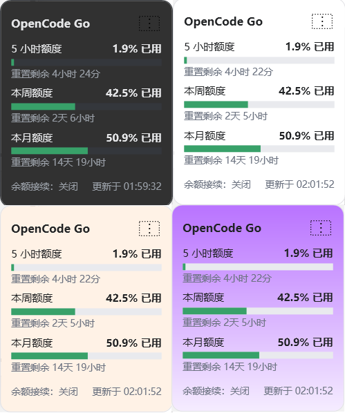
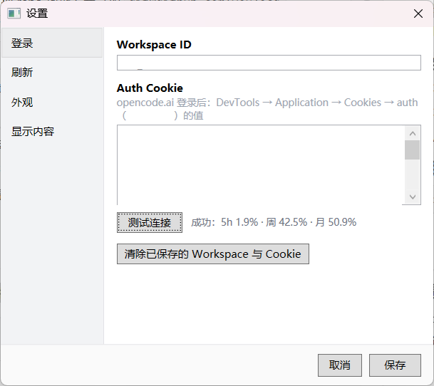
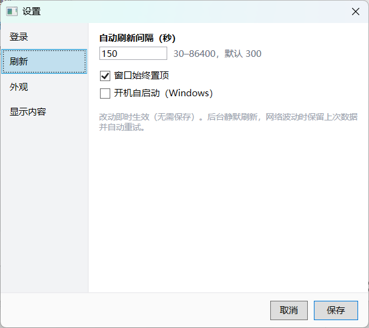
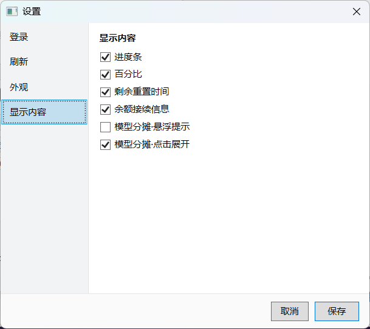
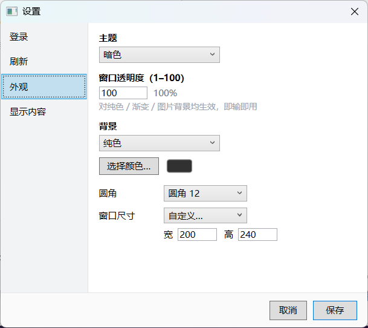

# OcgStatus — Windows 悬浮窗 · OpenCode Go 额度

Windows 单机悬浮窗，展示当前登录账号的 OpenCode Go 额度：**5 小时滚动 / 本周 / 本月** 三个窗口的已用百分比、进度条与重置倒计时，并可查看每个窗口的**模型用量分摊**。

## 额度说明

不是“日余量”。官方三档为：5 小时 `$12`、每周 `$30`、每月 `$60`（以美元额度计，实际请求数取决于模型价格）。

## 数据来源

额度来自用户登录后的 OpenCode 官网控制台，内部调用 `lite.subscription.get` / `lite.subscription.usage`，返回：

```text
useBalance
rollingUsage / weeklyUsage / monthlyUsage   ← 三窗口汇总（usagePercent / resetInSec）
rows[]                                      ← 按模型分摊（model / cost / quotaCost / contributionPercent）
```

**本应用在设备本地用 HttpClient 直连**：`GET https://opencode.ai/workspace/<ws>/go`（带用户提供的 auth Cookie）→ 命中内联 hydration 直接解析；否则扫描页面 JS bundle 提取 server function hash → `GET /_server`。不做服务端代理，不上传 Cookie/Workspace。

## 认证（手动输入，无需嵌入式浏览器）

1. 在浏览器登录 `opencode.ai`。
2. 访问 [https://opencode.ai/auth](https://opencode.ai/auth)，在 DevTools → Application → Cookies 中复制 `auth` 的值（格式支持 `auth=...` 或直接粘贴 token，应用会自动补全前缀）。
3. 在应用「设置 → 登录」页粘贴 `auth` 与 `Workspace ID`（`wrk_…`，来自 Go 页地址栏），点「测试连接」验证后保存。

Auth Cookie 保存在本地 `settings.json`（`%APPDATA%/OcgStatus/`），仅本机使用。

## 运行要求

- Windows 10/11 x64
- .NET 8 运行时（`dotnet publish --self-contained` 可免安装）

## 本地构建（Windows）

```powershell
dotnet build -c Release
dotnet publish src/OcgStatus.App/OcgStatus.App.csproj -c Release -r win-x64 --self-contained false
# 单文件免运行时：加 /p:PublishSingleFile=true --self-contained true
```

`OcgStatus.Core` 可在 Linux 构建（WPF 应用仅 Windows）。

## 功能

- 三条额度：已用百分比 + 进度条（绿 <60% / 橙 60–89% / 红 ≥90%）+ 重置剩余时间（5小时与周月支持独立开关）
- **模型分摊与悬浮提示**：悬浮额度行查看限额上限（5小时 `$12` / 周 `$30` / 月 `$60`）、重置倒计时与模型简表；点击展开完整分摊（模型 · $配额成本 · 占比），点窗口空白收起
- 启动即显示上次快照（`last-snapshot.json`），后台静默刷新（间隔 30–86400s 可调）
- 无边框置顶悬浮窗：**支持四周边缘鼠标拖拽自由缩放 (Resize)**、可拖动、双击标题切换紧凑模式、托盘（显示/刷新/登录/设置/重置窗口位置/退出）、屏幕越界自动纠正、位置记忆、开机自启
- **外观可定制**（设置 → 外观）：跟随系统/亮/暗主题（暗色主题下按钮自适应变白）、透明度 1–100、背景（纯色/渐变调色盘、图片）、圆角、窗口尺寸预设与自定义
- **显示内容开关**：进度条 / 百分比 / 5小时重置时间 / 周月重置时间 / 余额接续 / 模型分摊悬浮提示 / 模型分摊点击展开，7 项独立开关
- 单一设置窗口（左侧边栏：登录/刷新/外观/显示内容），非模态可与悬浮窗并行操作，登录页内嵌 `https://opencode.ai/auth` 跳转超链接并智能补全 `auth=` 前缀
- 断网时保留上次数据并提示“网络波动”，自动重试不覆盖界面

## 安全

- 不上传 Cookie、workspace ID 或用量数据；不做任何服务端代理
- 不在日志中记录 Cookie、响应全文或认证头
- Auth Cookie 仅存在本机 `settings.json`；设置页可一键清除

## 项目结构

```
src/OcgStatus.Core/   # 解析与模型（跨平台）
src/OcgStatus.App/    # WPF 悬浮窗、设置、托盘
```

## 免责声明

`lite.subscription.get` / `lite.subscription.usage` 为 opencode.ai 控制台的内部接口，非稳定公开 API；字段或 server function hash 可能随版本变化，应用会在解析失败时保留上次数据并自动重试。

## 截图

<div align="center">











</div>
